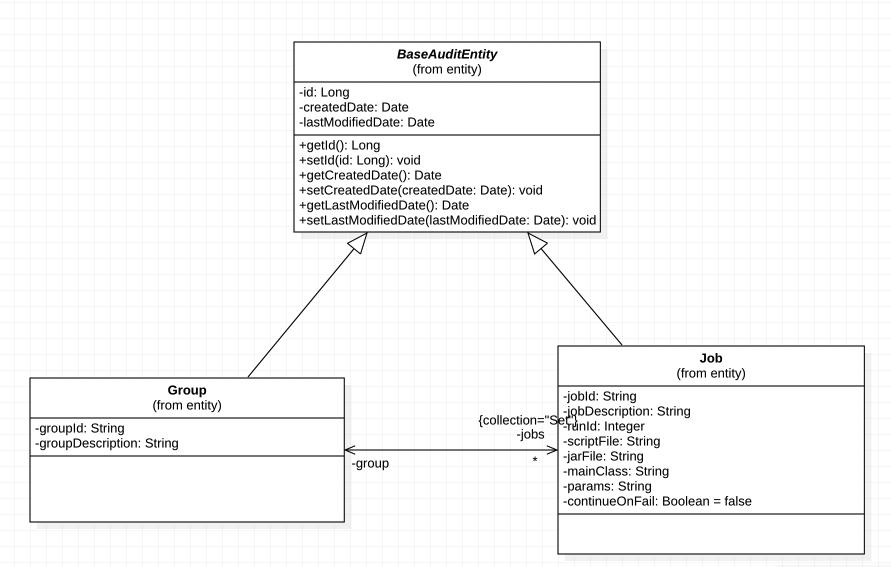
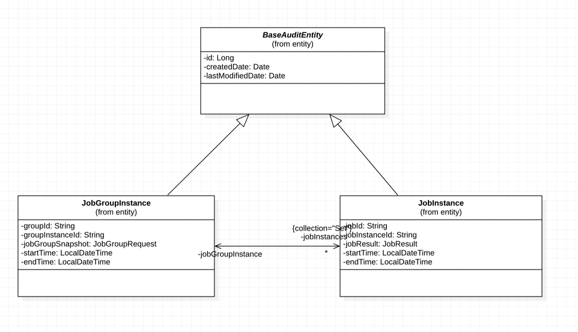

# grab-coding-exercise
#####Take home assignments for Grab interview
Following are the requirements of the assignment
Create a basic tool with RESTful API’s that manage and trigger the processes(ETL jobs).
Required features : 
- Store jobs and groups info. 
- One group can have multiple jobs. 
- A job represents a long-running process.
- A long-running process can be system sleep / logging and it may intermittently run forever to simulate a system failure.
- Have an endpoint to trigger a group.
- Once a group action is triggered, simulate the background process that runs all of the jobs within that group.
- The long-running process status can be tracked.

Following sections present the design of the service built to meet the above requirements.

The service is built using Spring Boot framework written in Java 8. The service uses MySQL as database and built for execution on Linux OS distributions.
Controller-Service-DAO pattern is used to implement the tool and the functionalities provided are broadly categorised into two functions.
1.  Creation and Management of Jobs and Group info. 
2. Triggering execution of a specific JobGroup and monitoring its status.

####Creation and Management of Jobs and JobGroups

As provided in the requirement, a Job represents any arbitrary process and is the fundamental abstraction in the design. A Group represents a collection of Jobs and management of Jobs occurs through the associated group. i.e., any operation on a Job has to happen in context of the Group.

Following shows the entity relation diagram of how this relationship.

  

      
  

{
    "groupId": "",
    "groupDescription": "",
    "jobs": [
        {
            "jobId": "",
            "jobDescription": "",
            "jobType": "",
            "runId": 1,
            "scriptPath": "",
            "jarPath": "",
            "mainClass": "",
            "params": ""
        }
    ]
}

to generate surefire report
 mvn surefire-report:report site
 
 
 swagger
 http://localhost:8090/jobservice/swagger-ui/#/
 
 
 java -jar grab-coding-exercise-0.0.1-SNAPSHOT.war
 
 The following shows the class diagram for the application

 
 
  
   

      
    
