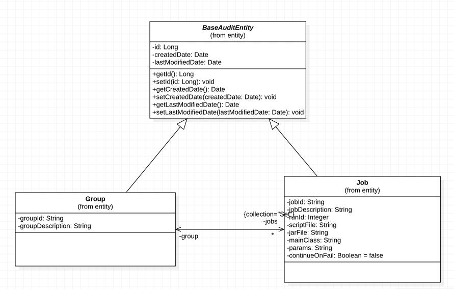
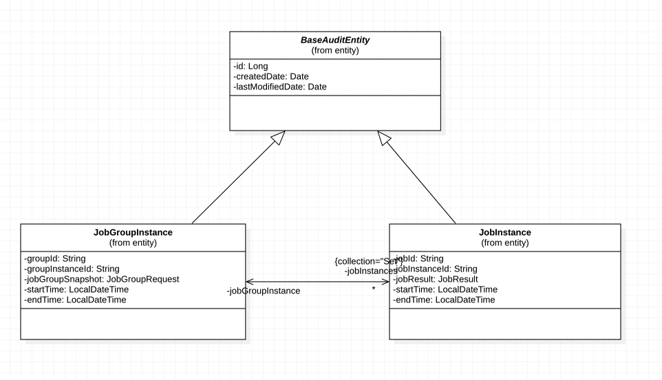
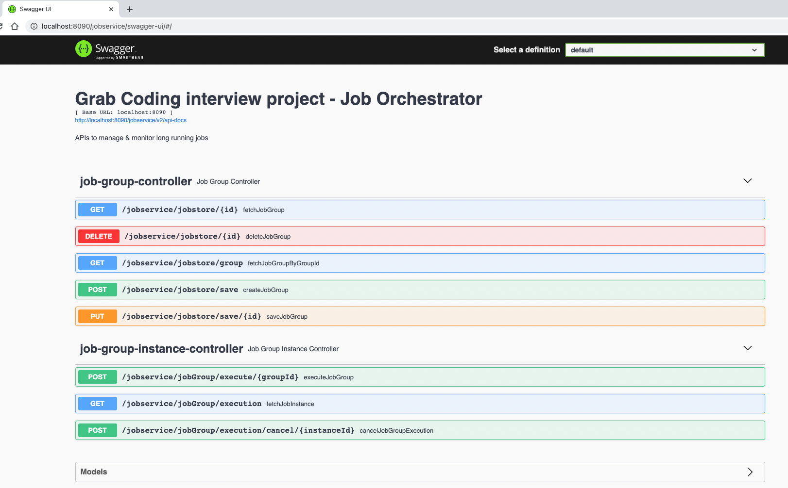

# Grab Coding Exercise
#### Take home assignment for Grab interview
Following are the requirements of the assignment.
Create a basic tool with RESTful API’s that manage and trigger long-running processes(ETL jobs).
Required features : 
- Store jobs and groups info. 
- One group can have multiple jobs. 
- A job represents a long-running process.
- A long-running process can be system sleep / logging and it may intermittently run forever to simulate a system failure.
- Have an endpoint to trigger a group.
- Once a group action is triggered, simulate the background process that runs all of the jobs within that group.
- The long-running process status can be tracked.

Following sections present the design of the service built to meet the above requirements.

The service is built using Spring Boot framework written in Java 8. The service uses MySQL as database and built for execution on Linux OS distributions.
Controller-Service-DAO pattern is used to implement the tool and uses Java's Concurrent library APIs to handle asynchronous execution of jobs. The functionalities provided are broadly categorised into two functions.
1. Creation and Management of Jobs and Group info. 
2. Execution of a JobGroup and monitoring its status.

#### Creation and Management of Jobs and JobGroups

As provided in the requirement, a Job represents any arbitrary process and is the fundamental abstraction in the design. A Group represents a collection of Jobs and management of Jobs occurs through the associated group. i.e., any operation on a Job has to happen in context of the Group.

Following shows the entity relation diagram of this relationship - JobGroup and Job.

  <p align="center">
      
  </p>

#### Execution of a JobGroup and monitoring its status.
Once a Group and its associated Jobs info is saved, the service provides a non-blocking API to trigger execution of the Group. This execution occurs in background where the associated Jobs executes sequentially. The status of the execution is asynchronously stored in DB and this info is accessible via another API.

Following shows the entity relation diagram of two entities, JobGroupInstance and JobInstance used to store the Job execution status.
<p align="center">
     
</p>

#### Artifact build and service start steps.
The project is created using maven and produces a war file as final artifact. 
Build command
```sh
$ mvn clean install
```
The artifact is created at
```sh
$ target/grab-coding-exercise-1.0.0.war
```
Surefire report plugin is enabled for the project for generating test execution report, the same can be generated using
 ```sh
 $  mvn surefire-report:report site
 ```
 The report will be generated at 
  ```sh
  $  target/site/surefire-report.html
  ```

To start the service, use following command
```sh
$ java -jar target/job-group-orchestrator.war
```
This starts the application in the embedded tomcat container on port 8090. Once the war boots up, the API's are made available on following url http://localhost:8090/jobservice.

Following showing snippet of stdout after the above command is executed.
```sh
2021-02-07 18:24:13.544  INFO 49899 --- [           main] j.LocalContainerEntityManagerFactoryBean : Initialized JPA EntityManagerFactory for persistence unit 'default'
2021-02-07 18:24:14.848  INFO 49899 --- [           main] c.n.g.s.i.JobGroupInstanceServiceImpl    : Creating executor service with 3 executor threads
2021-02-07 18:24:14.850  INFO 49899 --- [           main] c.n.g.s.i.JobGroupInstanceServiceImpl    : Setting up job tracker map clean up daemon
2021-02-07 18:24:14.853  INFO 49899 --- [pool-2-thread-1] c.n.g.s.i.JobGroupInstanceServiceImpl    : Removing following jobs instance from tracker 
2021-02-07 18:24:16.404  WARN 49899 --- [           main] JpaBaseConfiguration$JpaWebConfiguration : spring.jpa.open-in-view is enabled by default. Therefore, database queries may be performed during view rendering. Explicitly configure spring.jpa.open-in-view to disable this warning
2021-02-07 18:24:18.018  INFO 49899 --- [           main] o.s.s.concurrent.ThreadPoolTaskExecutor  : Initializing ExecutorService 'applicationTaskExecutor'
2021-02-07 18:24:20.616  INFO 49899 --- [           main] o.s.b.w.embedded.tomcat.TomcatWebServer  : Tomcat started on port(s): 8090 (http) with context path '/jobservice'
2021-02-07 18:24:20.622  INFO 49899 --- [           main] c.n.g.GrabCodingExerciseApplication      : Started GrabCodingExerciseApplication in 19.409 seconds (JVM running for 20.213)

```

#### API Description
Swagger UI is enabled for the project and can be accessed using URL http://localhost:8090/jobservice/swagger-ui/#/
<p align="center">
     
</p>

{
    "groupId": "",
    "groupDescription": "",
    "jobs": [
        {
            "jobId": "",
            "jobDescription": "",
            "jobType": "",
            "runId": 1,
            "scriptPath": "",
            "jarPath": "",
            "mainClass": "",
            "params": ""
        }
    ]
}


 
 
 swagger

 
 

 
 The following shows the class diagram for the application

 
 
  
   